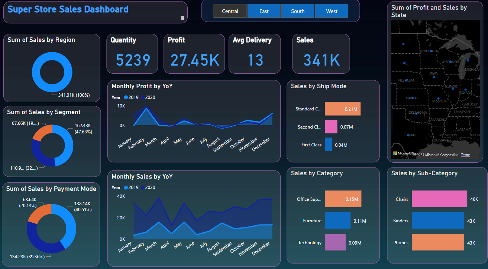

# Super-Store-Sales-Dashboard-in-Power-BI

This project features a comprehensive Super Store Sales Dashboard developed using Power BI. The dashboard provides key insights into sales performance, focusing on critical metrics to help analyze business trends and make informed decisions.

## Key Features:

  * **Quantity Analysis:** Track the total quantity of products sold to understand volume trends.
  * **Sales Performance:** Monitor overall sales figures to assess revenue generation and growth.
  * **Profitability Overview:** Analyze profit margins across various products and categories to identify profitable areas.
  * **Category Breakdown:** Explore sales and profit performance by product category for a high-level view.
  * **Sub-Category Insights:** Dive deeper into specific sub-categories to identify granular trends and opportunities.

# Demo Image

